# Argus v1 — Data Model

```mermaid
erDiagram
  USERS ||--o{ SESSIONS : "owns"
  USERS ||--o{ EMAIL_VERIFICATIONS : "claims"
  USERS ||--o{ PASSWORD_RESETS : "claims"
  USERS ||--o{ TRANSACTIONS : "records"
  USERS ||--o{ HOLDINGS : "holds"
  USERS ||--o{ PORTFOLIO_SNAPSHOTS : "valued at"
  USERS ||--o{ ALERT_RULES : "configures"
  USERS ||--o{ ALERT_FIRINGS : "received"
  USERS ||--o{ BACKFILL_JOBS : "triggered"
  USERS ||--o{ OUTBOX : "recipient"
  USERS ||--o{ ADMIN_AUDIT_LOG : "actor or target"

  SYMBOLS ||--o{ PRICE_HISTORY : "has closes"
  SYMBOLS ||--o{ BACKFILL_JOBS : "for ticker"
  SYMBOLS ||--o{ HOLDINGS : "priced by"
  SYMBOLS ||--o{ TRANSACTIONS : "referenced"

  USERS {
    uuid id PK
    text email UK "unique while is_deleted=false"
    text password_hash "argon2id"
    bool is_verified
    bool is_suspended
    bool is_deleted "soft delete"
    bool is_admin
    timestamptz created_at
    timestamptz updated_at
    timestamptz deleted_at
  }

  SESSIONS {
    uuid id PK
    uuid user_id FK
    text session_token UK
    text ip_address
    text user_agent
    timestamptz created_at
    timestamptz expires_at
    timestamptz last_activity_at
  }

  EMAIL_VERIFICATIONS {
    uuid id PK
    uuid user_id FK
    text token UK
    timestamptz created_at
    timestamptz expires_at "24h"
    timestamptz verified_at
  }

  PASSWORD_RESETS {
    uuid id PK
    uuid user_id FK
    text token UK
    timestamptz created_at
    timestamptz expires_at "1h"
    timestamptz claimed_at
  }

  TRANSACTIONS {
    uuid id PK
    uuid user_id FK
    text ticker FK
    text operation "BUY|SELL"
    numeric quantity "20,6"
    date trade_date
    timestamptz created_at
    timestamptz updated_at
  }

  HOLDINGS {
    uuid user_id PK,FK
    text ticker PK,FK
    numeric quantity "20,6"
    timestamptz updated_at
  }

  PORTFOLIO_SNAPSHOTS {
    uuid user_id PK,FK
    date snapshot_date PK
    numeric total_value "20,2"
  }

  SYMBOLS {
    text ticker PK
    text exchange "NYSE|NASDAQ"
    bool is_delisted
    timestamptz last_vendor_check
    timestamptz created_at
    timestamptz updated_at
  }

  PRICE_HISTORY {
    text ticker PK,FK
    date trade_date PK
    numeric close_price "20,6"
    bool is_split_adjusted
    timestamptz created_at
    timestamptz updated_at
  }

  BACKFILL_JOBS {
    uuid id PK
    text ticker FK
    uuid user_id FK "triggering user"
    text status "pending|in_progress|completed|failed"
    date start_date
    date end_date
    int price_count
    text error_message
    timestamptz created_at
    timestamptz started_at
    timestamptz completed_at
  }

  ALERT_RULES {
    uuid id PK
    uuid user_id FK
    text direction "UP|DOWN"
    numeric threshold "5,1; 0.5..100"
    int window_days "1|7|30|90|365|1095|1825"
    timestamptz created_at
  }

  ALERT_FIRINGS {
    uuid id PK
    uuid user_id FK
    uuid rule_id "soft ref; no FK"
    text direction
    numeric threshold
    int window_days
    timestamptz fired_at
    numeric portfolio_value_start "20,2"
    numeric portfolio_value_end "20,2"
    numeric percent_change "10,2"
    date window_start_date
    date window_end_date
  }

  OUTBOX {
    uuid id PK
    uuid aggregate_id "= user_id"
    text event_type "email.verification|email.password_reset|email.digest"
    jsonb payload
    text idempotence_key UK
    timestamptz created_at
    timestamptz published_at
    int error_count
    text last_error
    text published_by_worker_id
  }

  EOD_PIPELINE_RUNS {
    uuid id PK
    date run_date
    text trigger "cron|admin"
    text status
    timestamptz started_at
    timestamptz finished_at
    text step_symbols_status
    text step_prices_status
    text step_evaluate_status
    text error_message
  }

  ADMIN_AUDIT_LOG {
    uuid id PK
    uuid actor_id FK
    text action "SUSPEND|UNSUSPEND|DELETE|EOD_RUN|EOD_STEP_RERUN"
    uuid target_user_id FK
    jsonb metadata
    timestamptz created_at
  }
```

## Non-obvious cardinalities

- `alert_rules` and `alert_firings` are **disjoint physical tables** for the
  same logical entity. A rule starts life in `alert_rules`; the moment it
  fires, a row is inserted into `alert_firings` and the original row is
  deleted from `alert_rules` in the same transaction. `alert_firings.rule_id`
  is a soft reference (no FK) so deletion is unconstrained.
- `holdings(user_id, ticker)` is a composite PK and **derives entirely** from
  `transactions`. It is materialized for read performance and rebuilt on
  every transaction mutation in the same DB transaction.
- `portfolio_snapshots(user_id, snapshot_date)` is a composite PK; one row
  per user per trading day, written by the `eod-pipeline`.
- `outbox.aggregate_id` always references `users.id` in v1 but is named
  generically because the outbox is a shared infrastructure table that could
  hold non-user-scoped messages in the future.
