# Argus v1 — EOD Pipeline Sequence

End-of-day orchestration kicked off ~21:00 ET on US trading days. Owns the
post-close sequence: refresh symbols → fetch today's closes → snapshot every
active user's portfolio → evaluate every active alert rule → enqueue digest
emails. Retries inside the NFR-A6 window; per-step status persisted to
`eod_pipeline_runs` so the admin UI can re-run any single step.

```mermaid
sequenceDiagram
  autonumber
  participant CRON as Scheduler / Admin
  participant EOD as eod-pipeline
  participant DB as Postgres
  participant MD as market-data
  participant V as Price Vendor
  participant PF as portfolio
  participant AL as alerts
  participant EM as email
  participant W as Email Worker
  participant SMTP as Email Vendor

  CRON->>EOD: trigger run(run_date)
  EOD->>DB: INSERT eod_pipeline_runs<br/>(status=running, trigger)

  rect rgb(240,245,255)
    note over EOD,V: Step 1 — symbols refresh
    EOD->>MD: refreshSymbolUniverse()
    MD->>V: GET /symbols
    V-->>MD: NYSE + NASDAQ listings
    MD->>DB: UPSERT symbols<br/>(mark is_delisted as needed)
    MD-->>EOD: ok
    EOD->>DB: UPDATE step_symbols_status=ok
  end

  rect rgb(240,255,245)
    note over EOD,V: Step 2 — EOD prices for held tickers
    EOD->>PF: listHeldTickers()
    PF->>DB: SELECT DISTINCT ticker FROM holdings
    PF-->>EOD: tickers[]
    EOD->>MD: fetchCloses(tickers, run_date)
    loop per ticker (batched)
      MD->>V: GET /eod?ticker&date=run_date
      V-->>MD: close_price
    end
    MD->>DB: UPSERT price_history<br/>ON CONFLICT (ticker, trade_date)
    MD-->>EOD: ok
    EOD->>DB: UPDATE step_prices_status=ok
  end

  rect rgb(255,250,240)
    note over EOD,DB: Step 3a — portfolio snapshots
    EOD->>PF: snapshotAll(run_date)
    PF->>DB: per active user:<br/>Σ holdings.qty × price_history.close<br/>INSERT portfolio_snapshots
    PF-->>EOD: ok
  end

  rect rgb(255,245,250)
    note over EOD,EM: Step 3b — alert evaluation + digest enqueue
    EOD->>AL: evaluateAll(run_date)
    loop per active rule
      AL->>PF: getValueAt(user_id, run_date)<br/>getValueAt(user_id, run_date - window_days)
      PF->>DB: SELECT total_value<br/>FROM portfolio_snapshots
      PF-->>AL: { start, end }
      alt rule fires
        AL->>DB: BEGIN TX<br/>INSERT alert_firings (denormalized)<br/>DELETE alert_rules WHERE id=?<br/>INSERT outbox (event_type=email.digest,<br/>idempotence_key=hash(user,rule,date))<br/>COMMIT
      else does not fire
        AL->>DB: noop (rule stays active)
      end
    end
    AL-->>EOD: { fired: N, evaluated: M }
    EOD->>DB: UPDATE step_evaluate_status=ok,<br/>finished_at, status=ok
  end

  note over W,SMTP: Async — runs independently of the pipeline
  loop poll outbox WHERE published_at IS NULL
    W->>DB: SELECT FOR UPDATE SKIP LOCKED
    W->>SMTP: send(payload, idempotence_key)
    alt 2xx
      SMTP-->>W: accepted
      W->>DB: UPDATE outbox SET published_at=now()
    else transient failure
      SMTP-->>W: 5xx / timeout
      W->>DB: UPDATE error_count, last_error<br/>(exponential backoff via next-attempt-at)
    else terminal failure (>24h or 4xx)
      W->>DB: leave row in error state<br/>(ops alert&#59; alert_firings row intact)
    end
  end
```

## Failure semantics

- **Any step failure** is recorded on `eod_pipeline_runs.step_*_status` and
  the run is marked failed. The scheduler retries the **whole pipeline**
  until the NFR-A6 window closes; the per-step UPSERT semantics (prices,
  symbols) and the per-user idempotence on snapshots make retries safe.
- **Admin re-run** of a single step (`POST /admin/eod-pipeline/runs/:id/steps/:step`)
  operates on the same `run_id`, overwriting that step's status without
  rolling back upstream work.
- **Email delivery is decoupled.** Steps 1–3 complete (and the pipeline is
  reported successful) the moment outbox rows are written. The worker is a
  separate background thread; vendor outages never block evaluation or
  re-trigger rules.
- **One-shot alert guarantee is structural**: once `DELETE alert_rules
  WHERE id=?` commits, the rule cannot be evaluated again because the row
  no longer exists. No flag, no race, no compensating update.

## Idempotence checkpoints

| Step | Idempotent because |
|---|---|
| symbols UPSERT | `ON CONFLICT (ticker) DO UPDATE` |
| price_history UPSERT | `ON CONFLICT (ticker, trade_date) DO UPDATE` |
| portfolio_snapshots | PK `(user_id, snapshot_date)` — second write is a no-op or overwrite |
| alert evaluation | rule deletion + insert into `alert_firings` is in one TX; replay skips already-deleted rules |
| outbox send | `idempotence_key = hash(user_id, rule_id, run_date)` — vendor dedupes |
