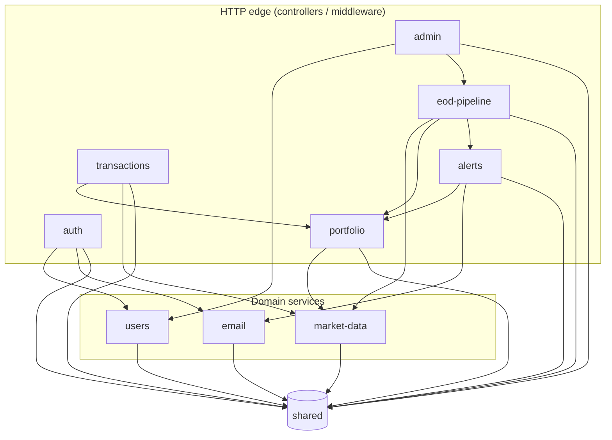

# Argus v1 — Module Dependencies

Allowed import directions between the nine business modules and the `shared`
layer. Every arrow `A --> B` reads as "module A may import from module B's
**published facade only**" — never from B's internals. The import-rule test
(per ADR-0001 §Confirmation) fails the build on any violation.

## Rules enforced by the import-rule test

1. **No module imports a peer module's internals.** Only the published facade
   (e.g. `UserService`, `PortfolioService`, `EmailService`, `PriceLookup`) is
   reachable across module boundaries.
2. **`shared` depends on nothing.** It is a sink, not a hub.
3. **No cycles.** The graph above is a DAG; any new edge that introduces a
   cycle fails the build.
4. **`users` has no outbound edges to other business modules.** It is the
   identity root; everyone reads/writes user state through `UserService`.
5. **`email` has no outbound edges to other business modules.** It is the
   delivery sink; callers hand it a fully-composed message via
   `EmailService`.
6. **`market-data` has no outbound edges to other business modules.** It is a
   reference-data provider; it exposes `PriceLookup` / `SymbolLookup` and
   never reaches back into transactions, portfolio, or alerts.

## Notable non-edges (intentional)

- `alerts → market-data` does **not** exist. Alerts read portfolio value
  from `portfolio_snapshots` (via `PortfolioService`); they never look at
  raw prices.
- `transactions → alerts` does **not** exist. Creating a transaction never
  triggers alert evaluation; evaluation is owned by `eod-pipeline`.
- `portfolio → transactions` does **not** exist. The `holdings` materialized
  table is updated by `portfolio` reacting to events published by
  `transactions` through the shared event envelope — not by reaching into
  the transactions module.
- No module imports `auth`. Authentication is enforced by HTTP middleware
  wired at the runtime layer, outside the module graph.
