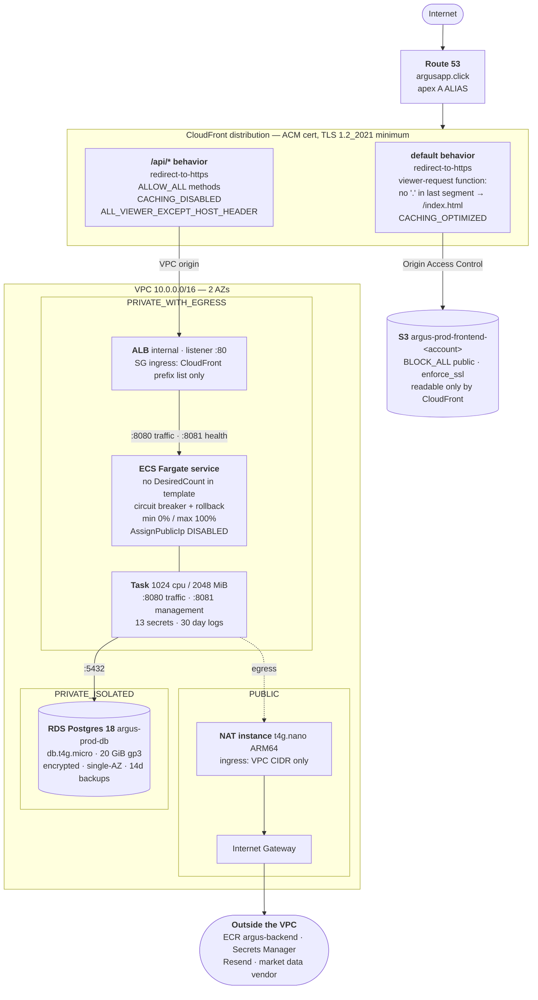
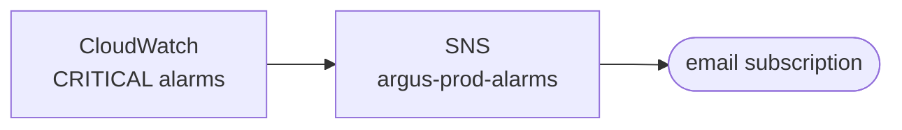

# Argus infrastructure

One CloudFront distribution serves both halves of the product: the frontend
bundle from S3, and everything under `/api/*` from the backend. That is what
lets the browser treat the API as same-origin — no CORS preflight on ordinary
requests, and first-party session cookies.

See [README.md](README.md) for how to deploy it.

## Topology

Nothing in the private subnets has a route to the internet except through that
one NAT instance, and nothing in the isolated subnet has one at all.

Critical alarms — NAT status check, database CPU, storage and connections, no
healthy backend task, backend 5xx — all deliver to one topic:

Response headers on every CloudFront response: HSTS
`max-age=31536000; includeSubDomains` (no `preload` — see below),
`X-Content-Type-Options: nosniff`, `X-Frame-Options: DENY`,
`Referrer-Policy: strict-origin-when-cross-origin`.

## Stacks

Deployed in two passes, because the ECS service cannot be created until an image
exists in ECR and ECR does not exist until CDK has run.

| Stack | Pass | Contains |
|---|---|---|
| `argus-prod-foundation` | 1 | ECR repository, GitHub OIDC provider, the two deploy roles, SNS alarm topic |
| `argus-prod-network` | 2 | VPC, subnets, NAT instance |
| `argus-prod-data` | 2 | RDS instance and its secret |
| `argus-prod-compute` | 2 | ALB, ECS cluster, task definition, service |
| `argus-prod-edge` | 2 | S3 bucket, ACM certificate, CloudFront, Route 53 record |

## SSM parameters

### Inputs — created by hand, never written by CDK

| Parameter | Used for |
|---|---|
| `/argus/prod/domain-name` | Read at synth |
| `/argus/prod/hosted-zone-id` | Read at synth; the zone is adopted, not created |
| `/argus/prod/alert-email` | Read at synth; alarm subscription |
| `/argus/prod/image-tag` | Seeded by hand at bootstrap, then written by CD Backend |
| `/argus/prod/env/app-base-url` | `ARGUS_APP_BASE_URL` |
| `/argus/prod/env/web-cors-allowed-origin` | `ARGUS_WEB_CORS_ALLOWED_ORIGIN` |
| `/argus/prod/env/web-cookie-domain` | `ARGUS_WEB_COOKIE_DOMAIN` |
| `/argus/prod/env/email-address` | `ARGUS_EMAIL_ADDRESS` |
| `/argus/prod/env/email-resend-api-url` | `ARGUS_EMAIL_RESEND_API_URL` |
| `/argus/prod/env/marketdata-massive-api-url` | `ARGUS_MARKETDATA_MASSIVE_API_URL` |

### Outputs — written by CDK, read by the CD workflows

Keyed by component rather than by AWS service, so each workflow reads exactly
one prefix and no workflow ever names a CloudFormation stack.

| Parameter | Written by |
|---|---|
| `/argus/prod/out/backend/repository-uri` | foundation |
| `/argus/prod/out/backend/repository-name` | foundation |
| `/argus/prod/out/backend/cluster-name` | compute |
| `/argus/prod/out/backend/service-name` | compute |
| `/argus/prod/out/backend/task-definition-family` | compute |
| `/argus/prod/out/backend/container-name` | compute |
| `/argus/prod/out/frontend/bucket-name` | edge |
| `/argus/prod/out/frontend/distribution-id` | edge |

## Secrets

`argus/prod/vendor-keys` — created by hand

| JSON key | Variable |
|---|---|
| `email-resend-api-key` | `ARGUS_EMAIL_RESEND_API_KEY` |
| `marketdata-massive-api-key` | `ARGUS_MARKETDATA_MASSIVE_API_KEY` |

`argus/prod/db` — created by CDK, generated password

| JSON key | Variable |
|---|---|
| `host` | `ARGUS_DB_HOST` |
| `port` | `ARGUS_DB_PORT` |
| `dbname` | `ARGUS_DB_NAME` |
| `username` | `ARGUS_DB_USERNAME` |
| `password` | `ARGUS_DB_PASSWORD` |

ECS injects each field of a secret as its own variable and cannot concatenate,
so the backend assembles its JDBC url from the five database fields.

## Repository variables

| Variable | Value |
|---|---|
| `AWS_REGION` | `us-east-1` |
| `BACKEND_DEPLOY_ROLE_ARN` | `arn:aws:iam::<account>:role/argus-prod-cd-backend` |
| `FRONTEND_DEPLOY_ROLE_ARN` | `arn:aws:iam::<account>:role/argus-prod-cd-frontend` |
| `VITE_API_BASE_URL` | `/api/v1` |

## Deliberate trade-offs

**A single NAT instance, not a NAT gateway.** A gateway costs more per month
than the rest of this environment combined. The trade is a single point of
failure: if it dies, image pulls, Secrets Manager and both vendor APIs go with
it. Accepted under the cost and availability targets in `docs/NFR.md`, and
alarmed on its status check so it is noticed rather than discovered.

**No interface VPC endpoints.** At this traffic volume they cost more than the
NAT instance they would replace.

**`min 0% / max 100%`** means a deploy stops the old task before starting the
new one. There is one task, so allowing two would double the bill during every
deploy — at the cost of a few seconds with nothing serving.

**No `preload` in HSTS.** `docs/NFR.md` §NFR-Sec4 specifies it, but submitting a
domain to the browser preload list is close to irreversible: browsers then
refuse plaintext for it and every subdomain regardless of the header, and
removal takes months. Deferred until the domain and its subdomains are settled.

**Four resources are retained** and survive both stack deletion and replacement:
the RDS instance, its secret, the frontend bucket, and the ECR repository. Each
carries an explicit physical name so a forced replacement fails on a name
collision rather than silently orphaning the original. Pinned by
`tests/retained_resources.json`.
